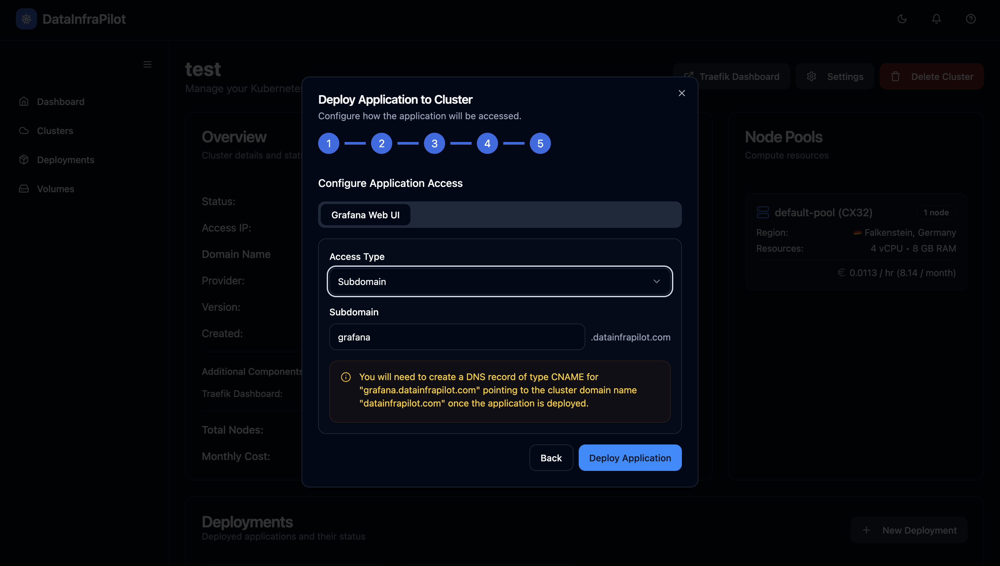

# DataInfraPilot

**DataInfraPilot** is a web application that helps small data engineering teams easily deploy and manage selected data engineering tools on Kubernetes clusters running on cost-effective cloud providers.

---

## Project Structure

```
DataInfraPilot/
├── backend/      # FastAPI backend API
├── frontend/     # React frontend web app
├── demo/         # Example demo project
├── docker-compose.yml
└── README.md
```

- [Backend](./backend/README.md): REST API for orchestration and management
- [Frontend](./frontend/README.md): User interface for deployment and monitoring
- [Demo Project](./demo/README.md): Example pipeline and usage

---

## Features

- K8s cluster provisioning
- Selected Data Engineering tools deployment
- Cluster autoscaling through the Cluster Autoscaler
- Automated SSL certificate provisioning through the Cert Manager

---

## Supported Cloud Providers
- Hetzner

---

## Supported Applications
- Apache Airflow
- Apache Spark
- Grafana

---

## Technology Stack

| Part         | Main Technologies                                |
|--------------|--------------------------------------------------|
| Backend      | Python, FastAPI                                  |
| Frontend     | React, TypeScript, Vite, Tailwind CSS, shadcn-ui |
| Demo Project | Airflow, PostgreSQL, Python, Grafana             |

---

## Running Locally

### Manual (separate terminals)
```bash
pre-commit install
```

**Backend**
```bash
cd backend
uv sync
source .venv/bin/activate
uvicorn src.api.main:app --reload
```

**Frontend**
```bash
cd frontend
npm install
npm run dev
```

### With Docker Compose

```bash
docker-compose up
```
---

## Screenshots
### Cluster provisioning


### Application deployment





