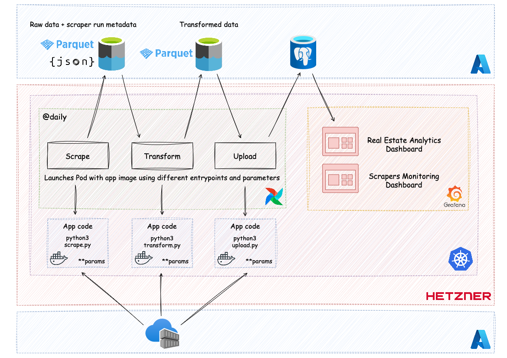

# Demo Project (Scraping ETL)

This demo project includes a simple ETL pipeline designed to gather real estate data from 2 sources.

The pipeline consists from the following steps:
1. Scrape data from the source and store it into Azure Data Lake Storage (ADLS)
2. Download raw data from ADLS, transform it and upload back to ADLS
3. Download transformed data from ADLS and upload it to PostgreSQL DB

## High-level overview
Below is an example of the full project with Airflow as an orchestration tool and Grafana as a visualisation tool.



## How to run
### Prerequisites
First, create a `.env` file and populate it with your values
```bash
cp .env.sample .env
```

Then create a virtual environment and install dependencies (not required if intend to run the app in Docker)
```bash
uv sync
```

### Options to run
Option 1 - using orchestration scripts

```bash
python3 src/orchestration/scrape.py --project <project_name> --listing-type <rent_or_sale>
python3 src/orchestration/transform.py --project <project_name> --listing-type <rent_or_sale>
python3 src/orchestration/upload_to_db.py --project <project_name> --listing-type <rent_or_sale>
```

Option 2 - run full pipeline

```bash
./src/orchestration/run_pipeline.sh <project_name> <rent_or_sale>
```

Option 3 - run in Docker
```bash
# Build Docker image if needed
docker build -t <image_name> .

docker run --env-file .env <image_name> python3 -m src.orchestration.scrape --project <project_name> --listing-type <rent_or_sale>
docker run --env-file .env <image_name> python3 -m src.orchestration.transform --project <project_name> --listing-type <rent_or_sale>
docker run --env-file .env <image_name> python3 -m src.orchestration.upload_to_db --project <project_name> --listing-type <rent_or_sale>
```